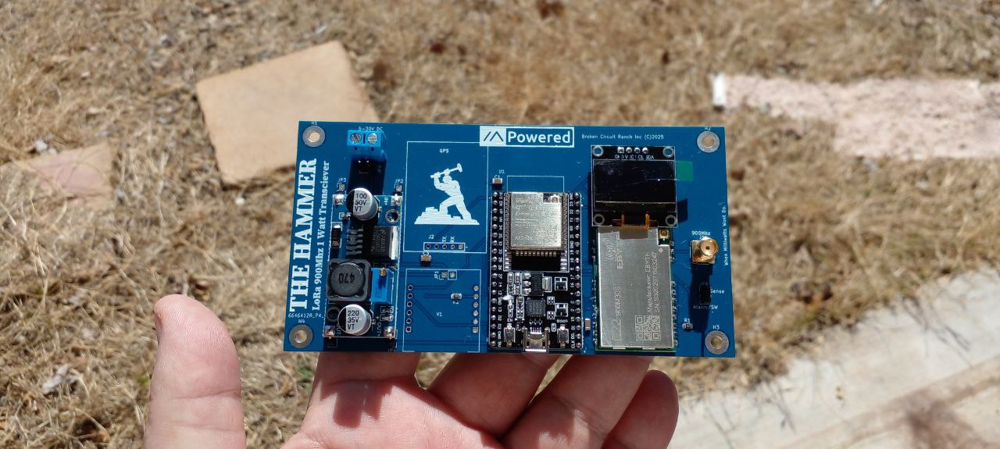
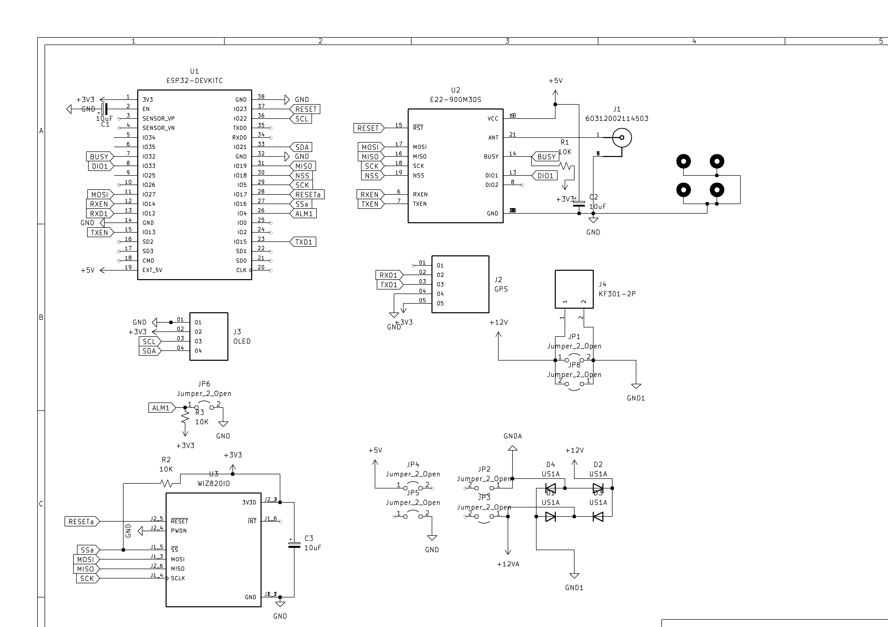

# Hammer-1W_LORA-board
Hammer Board 1W LORA Circuit Board

# Hammer Board

## Overview
The **Hammer Board** is a ESP32-based development board designed for hobbyists and makers building IoT and networked projects. With integrated Ethernet, OLED display, LORA E22 wireless card, GPS, Wiznet 5500 Ether Module. This repository provides the circuit diagram, bill of materials (BOM), and example firmware to help you build and customize the Hammer Board.

## Board Features
- **Core**: ESP32-WROOM-32 module (dual-core, 240 MHz, Wi-Fi, Bluetooth).
- **Ethernet**: W5500 module (SPI: CS=16, SCK=5, MISO=19, MOSI=27, RST=17)
- **Display**: 0.96-inch I2C OLED (128x64, SDA=21, SCL=22) for real-time status and debugging.
- **I/O**: Multiple GPIO pins for sensors, actuators, or add-ons.
- **Power**: The unit can be POE powered with Modified Wiznet module, Or Screw power terminals. Any polarity ok, Buck converter reduces voltage to 5.2V for ESP32 and full power output on the E22 card.
- **Compact Design**: Optimized for breadboard prototyping or custom PCB fabrication.

## Circuit Diagram
The Hammer Board’s circuit diagram is the blueprint for its functionality, detailing all connections for easy replication or modification. Find it in [`/schematics/hammer_board_schematic`](schematics/Hammer Board v2 Schematic.png) (created in [e.g., KiCad]).

### Using the Circuit Diagram
1. Open the schematic.
2. Check the [BOM](schematics/BOM.csv) for component part numbers and sourcing (e.g., DigiKey, Mouser, other).
4. Modify the design as needed, respecting the [CC BY-NC 4.0 license](#license).

   git clone https://github.com/yourusername/hammer-board  OR copy the variant/diy/hammer-Board/variant.ini and variant/diy/platformio.ini to the main trunk of meshtastic and compile. 
It compiles like ethernet should work but as far as meshtastic, Im not the hot shot programmer and have no clue why there is no traffic or why it does not talk. There is some talk on the forums as to why there is no Ethernet, but nothing resolved. 
The ethernet does work with standard w5500 sketches in the arduino ecosystem just not meshtastic. Have not tested funcionality on reticulum or meshcore as of this wirting. 

Enjoy guys! hope you can get inspired!
